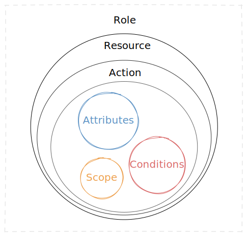
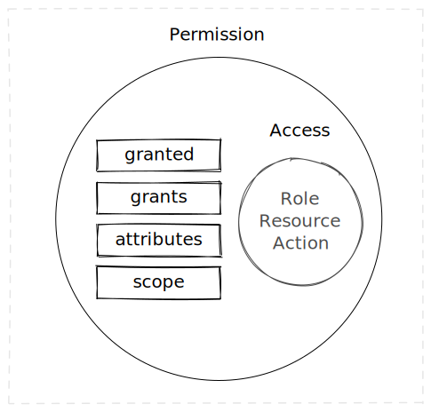
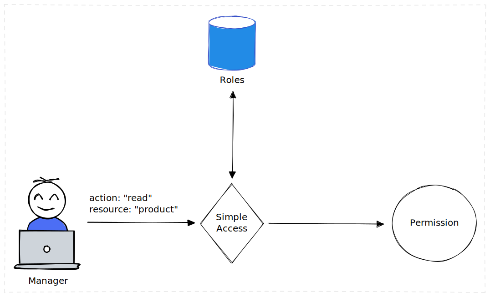

# **Simple Access**

Attribute-Role-Based Hybrid Access Control Library

[](https://nodejs.org)
[](https://www.npmjs.com/package/simple-access)
[](https://github.com/m-elbably/simple-access/workflows/simple-access/badge.svg)
[](https://coveralls.io/github/m-elbably/simple-access?branch=master)
[](https://raw.githubusercontent.com/m-elbably/simple-access/master/LICENSE)

> **V2.0 Breaking Changes**<br>
> The `conditions` property has been removed from the `action` object due to its side effects. Instead, you can use the `scope` property to add custom attributes and validate them using application logic.

## Installation
```bash
npm install simple-access --save
````

## Features
- Hybrid access control with the best features from RBAC & ABAC
- Ability to filter resource data based on granted permission
- Simplicity & flexibility

## Introduction

**Access control** is a security technique that regulates who or what can view or use resources in a computing environment.

Access Control involves:
- Preventing unauthorized users from gaining access to resources
- Preventing legitimate users from accessing resources in an unauthorized manner
- Enabling legitimate users to access resources in an authorized manner

### RBAC
**Role-Based Access Control** is a policy-neutral access-control mechanism defined around roles and privileges assigned to a user.<br>
RBAC is an additive model, so if you have overlapping role assignments, your effective grants are the union of your role assignments.

**Example:**<br>
If we have an API the provides data to eCommerce application, we may have a role of `manager` with access to a resource `product` and allowed actions `["create", "read", "update"]`, and another role `operation` with access to a resource `product` and allowed actions `["archive"]`. So Any users with both `manager` and `operation` roles will be able to `["create", "read", "update", "archive"]` products.

### ABAC
**Attribute-Based Access Control** provides access to users based on who they are rather than what they do.

## Components

### Subject
An entity capable of accessing resources.

### Resource
An entity that contains and/or receives information to which access is controlled, like "Files", "Messages".

### Role
Role is the level of access given to subject (user or business entity) when this role assigned to it, it is properly viewed as a semantic construct around which access control policy is formulated.

- Role may grant access to one or more unique resources
- Resource may grant access to resource with based on one or more unique actions
- Action may have list of attributes that can be used to filter resource data

> Subject (User or business entity) can have one or more roles assigned based on their responsibilities and qualifications.

<p align="center">

</p>

**Role Schema**
```json
{
    "name": "string",
    "resources": [
        {
            "name": "string",
            "actions": [
                {
                    "name": "string",
                    "attributes": ["string"],
                    "scope": "object"
                }
            ]
        }
    ]
}
```

>Scope is just an object that may include any metadata to be used but applications to evaluate additional constraints on subject based on application business logic.

### Permission

Permission describes the way in which a subject may access a resource

<p align="center">

</p>

**Permission Schema**
```json
{
	"granted": "boolean",
	"access": {
		"roles": ["string"],
		"action": "string",
		"resource": "string"
	},
	"grants": "object",
	"attributes": ["string"],
	"scope": "object"
}
```

## Roles Storage
This library does not handle roles storage and management (Not the library concern), It has a basic `MemoryAdapter` implemented by extending `BaseAdapter` , If you need to handle more complex scenarios you will probably need to extend `BaseAdapter` implementing your own storage for example using `[MySQL, MongoDB, Redis]`

### Memory Adapter
Memory adapter is a built-in roles adapter that stores all roles data into memory with simple structure.

### Implement Custom Roles Adapter
You can implement your own roles adapter by extending `BaseAdapter` class and implement `getRolesByName` method, considering that the `getRolesByName` can return `Array<Role>` or `Promise<Array<Role>>` and you can define the return type when creating your adapter class.


**Example:**
```typescript
import { BaseAdapter, Role, ErrorEx } from "simple-access";

export class MemoryAdapter<
    R extends [string, string, string]
> extends BaseAdapter<R, Array<Role<R>>> {
    private _roles: Array<Role<R>>;
    private _cache: { [k: string]: Role<R> } = {};

    constructor(roles: Array<Role<R>>) {
        super("MemoryAdapter");
        this.setRoles(roles);
    }

    setRoles(roles: Array<Role<R>>): void {
        if (roles == null || !Array.isArray(roles) || roles.length === 0) {
            throw new ErrorEx(
                ErrorEx.VALIDATION_ERROR,
                `Missing/Invalid roles array in "${this.constructor.name}"`
            );
        }

        this._roles = roles;
        this._cache = {};
        // Cache roles by name
        this._roles.forEach((role: Role<R>) => {
            // this.validateGrant(grant, true);
            this._cache[role.name] = role;
        });
    }

    getRoles(): Array<Role<R>> {
        return this._roles;
    }

    getRolesByName(names: Array<Role<R>["name"]>): Array<Role<R>> {
        const result: Array<Role<R>> = [];

        if (names == null) {
            throw new ErrorEx(
                ErrorEx.VALIDATION_ERROR,
                `Roles names array can not be null or undefined`
            );
        }

        for (let i = 0; i < names.length; i += 1) {
            if (this._cache[names[i]] != null) {
                result.push(this._cache[names[i]]);
            }
        }

        return result;
    }
}
```

## How Simple Access Works?

<p align="center">

</p>

- **Subject** (user or business entity) assigned one or more roles
- **Subject** request access to a resource
- **Simple Access** check **subject** set of roles to validate access to provided resource and action
- **Simple Access** returns permission object

Let's use the following set of roles as an example:
```typescript
import type { Role } from "simple-access";

type RoleNamesType = "administrator" | "operation";
type ResourceNamesType = "product" | "order" | "file";
type ActionNamesType = "create" | "read" | "update" | "delete"
type RoleDefinition = [RoleNamesType, ResourceNamesType, ActionNamesType]

const roles: Role<RoleDefinition>[] = [
  {
    "name": "administrator",
    "resources": [
      {"name": "product", "actions": ["*"]},
      {"name": "order", "actions": ["*"]},
      {"name": "file", "actions": ["*"]}
    ]
  },
  {
    "name": "operation",
    "resources": [
      {
        "name": "product",
        "actions": [
          {"name": "create", "attributes": ["*"]},
          {"name": "read", "attributes": ["*"]},
          {"name": "update", "attributes": ["*","!history"]},
          {
            "name": "delete",
            "attributes": ["*"]
          }
        ]
      },
      {
        "name": "order",
        "actions": [
          {"name": "create", "attributes": ["*"]},
          {"name": "read", "attributes": ["*"]},
          {"name": "update", "attributes": ["*"]}
        ]
      }
    ]
  }
];
```

### Validating Access With Single Role

You can check access using `can` method:
<br>
`can(role: Array<string> | string,  action: string, resource: string): Promise<Permission> | Permission` 

Check subject (with "operation" role) permission to "read" the resource "order", please note that `can` method return type depends on the return type of `getRolesByName` method in the  adaptor you are using. In the following example the `getRolesByName` method in the `MemoryAdaptor` return type is `Array<Role>`

```typescript
import {
    type Role,
    SimpleAccess,
    MemoryAdapter
} from "simple-access";
import type {
    RoleDefinition
} from './roles';

type RoleNamesType =
    "administrator"
    | "operation";
type ResourceNamesType =
    "product"
    | "order"
    | "file";
type ActionNamesType =
    "create"
    | "read"
    | "update"
    | "delete"
type RoleDefinition = [RoleNamesType, ResourceNamesType, ActionNamesType]

const roles: Role<RoleDefinition>[] = [
    {
        "name": "administrator",
        "resources": [
            {
                "name": "product",
                "actions": ["*"]
            },
            {
                "name": "order",
                "actions": ["*"]
            },
            {
                "name": "file",
                "actions": ["*"]
            }
        ]
    },
    {
        "name": "operation",
        "resources": [
            {
                "name": "product",
                "actions": [
                    {
                        "name": "create",
                        "attributes": ["*"]
                    },
                    {
                        "name": "read",
                        "attributes": ["*"]
                    },
                    {
                        "name": "update",
                        "attributes": ["*", "!history"]
                    },
                    {
                        "name": "delete",
                        "attributes": ["*"]
                    }
                ]
            },
            {
                "name": "order",
                "actions": [
                    {
                        "name": "create",
                        "attributes": ["*"]
                    },
                    {
                        "name": "read",
                        "attributes": ["*"]
                    },
                    {
                        "name": "update",
                        "attributes": ["*"]
                    }
                ]
            }
        ]
    }
];

const adapter = new MemoryAdapter(roles);
const simpleAccess = new SimpleAccess<RoleDefinition, typeof adapter>(adapter);

const permission = simpleAccess.can("operation", "read", "order");
if (permission.granted) {
    console.log("Permissin Granted");
}
```

The returned permission
```json
{
    "granted": true,
    "access": {
        "roles": [
            "operation"
        ],
        "action": "read",
        "resource": "order"
    },
    "grants": {
        "product": {
            "create": {
                "name": "create",
                "attributes": [
                    "*"
                ]
            }
        }
    },
    "attributes": [
        "*"
    ],
    "scope": {}
}
```

>`can` function **only** checks if *subject* with assigned role *operation* **can** access the **resource** _order_ through _read_ action, It will not filter resource data, as this functionality provided through other functions and needs additional information to work properly.

### Validating Access with Overlapped Roles
**Simple Access** will merge overlapped roles before validation according to these details:

- **Resources** are merged (Union).
  If subject assigned the previous set of roles `["administrator", "operation"]` then this subject will have access to these resource `["product", "order", "file"]`
- **Actions** are merged (Union), and the most permissive action will override.
    - Role _A_ with resource _order_ and actions _*_ will override role _B_ with actions `["read", "create"]`
    - Role _A_ with resource _order_ and actions `["read", "update"]` and role _B_ with actions `["create", "delete"]` will be merged in one resource _order_ with actions `["read", "update", "create", "delete"]`
- **Attributes** are merged, and the most permissive attributes will override.
    - Attributes `["*"]` will override attributes `["name", "age", "!address"]`
    - Attributes `["name", "age"]` will merge with attributes `["address"]` into new attributes array `["name", "age", "address"]`
    - Attributes `["*", "!address"]` will be merged with attributes `["age"]` into new attributes array `["*", "!address"]`
    - Attributes `["*", "!age"]` will be merged with attributes `["*", "!image", "!address"]` into new attributes array `["*"]` and `["age" , "image", "address"]` will be allowed because they are not negated from both sides
    - Attributes `["*", "!age"]` will be merged with attributes `["image"]` into new attributes array `["*", "!age"]` and `"image"` attributes will be omitted because its by default allowed

>**Projected** (Allowed) attributes gets merged based on a **union** operation<br>
>**Negated** (Not allowed) attributes gets merged based on **intersection** operation

- **Scopes** are merged (Union), and the most permissive scope will override.
    - Empty scope `{}` will override all other scopes
    - Scope `{"group": 123}` will be merged with scope `{"tenant": 321}` into:
  ```json
  {
      "group": 123,
      "tenant": 321
  }	    
  ```

Example:
```typescript
import {
    type Role,
    SimpleAccess,
    MemoryAdapter
} from "simple-access";
import type {
    RoleDefinition
} from './roles';

type RoleNamesType =
    "administrator"
    | "operation";
type ResourceNamesType =
    "product"
    | "order"
    | "file";
type ActionNamesType =
    "create"
    | "read"
    | "update"
    | "delete"
type RoleDefinition = [RoleNamesType, ResourceNamesType, ActionNamesType]

const roles: Role<RoleDefinition>[] = [
    {
        "name": "administrator",
        "resources": [
            {
                "name": "product",
                "actions": ["*"]
            },
            {
                "name": "order",
                "actions": ["*"]
            },
            {
                "name": "file",
                "actions": ["*"]
            }
        ]
    },
    {
        "name": "operation",
        "resources": [
            {
                "name": "product",
                "actions": [
                    {
                        "name": "create",
                        "attributes": ["*"]
                    },
                    {
                        "name": "read",
                        "attributes": ["*"]
                    },
                    {
                        "name": "update",
                        "attributes": ["*", "!history"]
                    },
                    {
                        "name": "delete",
                        "attributes": ["*"]
                    }
                ]
            },
            {
                "name": "order",
                "actions": [
                    {
                        "name": "create",
                        "attributes": ["*"]
                    },
                    {
                        "name": "read",
                        "attributes": ["*"]
                    },
                    {
                        "name": "update",
                        "attributes": ["*"]
                    }
                ]
            }
        ]
    }
];

const adapter = new MemoryAdapter(roles);
const simpleAccess = new SimpleAccess<RoleDefinition, typeof adapter>(adapter);

const permission = simpleAccess.can(["operation", "support"], "read", "order");

if(permission.granted) {
    console.log("Permissin Granted");
}
```

### Filtering Data
**Simple Access** can filter resource object data based on specific permission and return only allowed attributes.

>Simple Access is depending on [Floppy Filter](https://github.com/m-elbably/floppy-filter) library for complex object filtering, Please check its documentation to know how to select or negate attributes in an efficient way.

You can do this using `filter` function:<br>
`filter(permission: Permission, data: Object): Object`

**Example:**
```typescript
import {
    type Role,
    SimpleAccess,
    MemoryAdapter
} from "simple-access";
import type {
    RoleDefinition
} from './roles';

type RoleNamesType =
    "administrator"
    | "operation";
type ResourceNamesType =
    "product"
    | "order"
    | "file";
type ActionNamesType =
    "create"
    | "read"
    | "update"
    | "delete"
type RoleDefinition = [RoleNamesType, ResourceNamesType, ActionNamesType]

const roles: Role<RoleDefinition>[] = [
    {
        "name": "administrator",
        "resources": [
            {
                "name": "product",
                "actions": ["*"]
            },
            {
                "name": "order",
                "actions": ["*"]
            },
            {
                "name": "file",
                "actions": ["*"]
            }
        ]
    },
    {
        "name": "operation",
        "resources": [
            {
                "name": "product",
                "actions": [
                    {
                        "name": "create",
                        "attributes": ["*"]
                    },
                    {
                        "name": "read",
                        "attributes": ["*"]
                    },
                    {
                        "name": "update",
                        "attributes": ["*", "!history"]
                    },
                    {
                        "name": "delete",
                        "attributes": ["*"]
                    }
                ]
            },
            {
                "name": "order",
                "actions": [
                    {
                        "name": "create",
                        "attributes": ["*"]
                    },
                    {
                        "name": "read",
                        "attributes": ["*"]
                    },
                    {
                        "name": "update",
                        "attributes": ["*"]
                    }
                ]
            }
        ]
    }
];

const adapter = new MemoryAdapter(roles);
const simpleAccess = new SimpleAccess<RoleDefinition, typeof adapter>(adapter);
const resource = {
    "authorId": 1002,
    "price": 75.08
};

const permission = simpleAccess.can("operation", "read", "order");

if(permission.granted) {
    const filteredResource = simpleAccess.filter(permission, resource);
}
```

For simplicity and flexibility you can also call `filter` from **Permission** object
```typescript
const permission = simpleAccess.can("operation", "read", "order");
if(permission.granted) {
    const filteredResource = permission.filter(resource);
}
```

## Contributors

<a href="https://github.com/m-elbably/simple-access/graphs/contributors">
  
</a>

#### License
MIT

